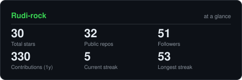
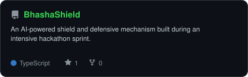
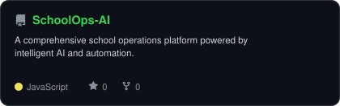
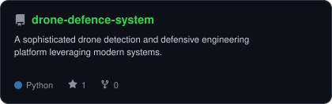
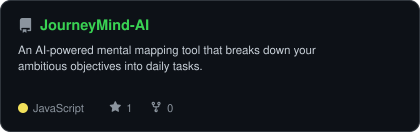

<div align="center">

<!-- PORTRAIT - generated by scripts/dotify.py from assets/source-photo.jpg -->


<br>

<!-- NAME / TAGLINE - animated typing -->
<a href="https://github.com/Rudi-rock">
  
</a>

<br>

<!-- SOCIALS -->
<a href="https://linkedin.com/in/rudra-srm"></a>
<a href="https://instagram.com/its_rudra.s"></a>


</div>

---

## `~/` whoami

```console
$ cat about.txt
```

Hi, I'm **Rudra Pratap Singh (Rudi)**. I'm a CSE student at SRMIST building things that sit somewhere between AI, cybersecurity, and the web, and I thrive in competitive 24-hour hackathons (23+ completed).

- Currently exploring **AI-powered architectures and advanced system security**
- Building ambitious engineering projects and leading development teams
- Learning **Next.js + AI integrations**
- Fun fact: **I love turning caffeine into clean, production-ready code during intense hackathons.**

<br>

<div align="center">

## `~/` toolbox


</div>

---

<div align="center">

## `~/` skill radar

<table>
<tr>
<td width="50%" align="center" valign="middle">

<!-- Self-rated radar - edit assets/skills.json, the workflow redraws it -->
<picture>
  <source media="(prefers-color-scheme: dark)"  srcset="assets/radar-dark.svg">
  <source media="(prefers-color-scheme: light)" srcset="assets/radar-light.svg">
  
</picture>

</td>
<td width="50%" align="center" valign="middle">

<!-- Live radar built from real language byte counts across your repos -->
<picture>
  <source media="(prefers-color-scheme: dark)"  srcset="assets/radar-langs-dark.svg">
  <source media="(prefers-color-scheme: light)" srcset="assets/radar-langs-light.svg">
  
</picture>

</td>
</tr>
</table>

</div>

---

<div align="center">

## `~/` contribution calendar

<!-- 3D isometric calendar, regenerated every 6h by .github/workflows/metrics.yml -->


<br><br>

<!-- Snake eats the contribution graph - .github/workflows/snake.yml -->
<picture>
  <source media="(prefers-color-scheme: dark)"  srcset="https://raw.githubusercontent.com/Rudi-rock/Rudi-rock/output/snake-dark.svg">
  <source media="(prefers-color-scheme: light)" srcset="https://raw.githubusercontent.com/Rudi-rock/Rudi-rock/output/snake.svg">
  
</picture>

</div>

---

<div align="center">

## `~/` the numbers

<!-- Generated by scripts/cards.py into this repo. -->
<picture>
  <source media="(prefers-color-scheme: dark)"  srcset="assets/card-stats-dark.svg">
  <source media="(prefers-color-scheme: light)" srcset="assets/card-stats-light.svg">
  
</picture>

<br>


<br><br>


</div>

---

<div align="center">

## `~/` selected work

<!-- Cards generated by scripts/cards.py from assets/projects.json. -->
<table>
<tr>
<td width="50%">
  <a href="https://github.com/Rudi-rock/BhashaShield">
    <picture>
      <source media="(prefers-color-scheme: dark)"  srcset="assets/card-BhashaShield-dark.svg">
      <source media="(prefers-color-scheme: light)" srcset="assets/card-BhashaShield-light.svg">
      
    </picture>
  </a>
</td>
<td width="50%">
  <a href="https://github.com/Rudi-rock/SchoolOps-AI">
    <picture>
      <source media="(prefers-color-scheme: dark)"  srcset="assets/card-SchoolOps-AI-dark.svg">
      <source media="(prefers-color-scheme: light)" srcset="assets/card-SchoolOps-AI-light.svg">
      
    </picture>
  </a>
</td>
</tr>
<tr>
<td width="50%">
  <a href="https://github.com/Rudi-rock/drone-defence-system">
    <picture>
      <source media="(prefers-color-scheme: dark)"  srcset="assets/card-drone-defence-system-dark.svg">
      <source media="(prefers-color-scheme: light)" srcset="assets/card-drone-defence-system-light.svg">
      
    </picture>
  </a>
</td>
<td width="50%">
  <a href="https://github.com/Rudi-rock/JourneyMind-AI">
    <picture>
      <source media="(prefers-color-scheme: dark)"  srcset="assets/card-JourneyMind-AI-dark.svg">
      <source media="(prefers-color-scheme: light)" srcset="assets/card-JourneyMind-AI-light.svg">
      
    </picture>
  </a>
</td>
</tr>
</table>

<sub>

| project | live | stack |
|---|---|---|
| **[BhashaShield](https://github.com/Rudi-rock/BhashaShield)** | [Link](https://github.com/Rudi-rock/BhashaShield) | `Python` `AI` |
| **[SchoolOps-AI](https://github.com/Rudi-rock/SchoolOps-AI)** | [Link](https://github.com/Rudi-rock/SchoolOps-AI) | `Next.js` `AI` |
| **[drone-defence-system](https://github.com/Rudi-rock/drone-defence-system)** | [Link](https://github.com/Rudi-rock/drone-defence-system) | `Systems` |
| **[JourneyMind-AI](https://github.com/Rudi-rock/JourneyMind-AI)** | [Link](https://github.com/Rudi-rock/JourneyMind-AI) | `AI` `Web` |

</sub>

</div>

---

<div align="center">

<sub>`01110100 01101000 01100001 01101110 01101011 01110011 00100000 01100110 01101111 01110010 00100000 01110011 01100011 01110010 01101111 01101100 01101100 01101001 01101110 01100111`</sub>

</div>
