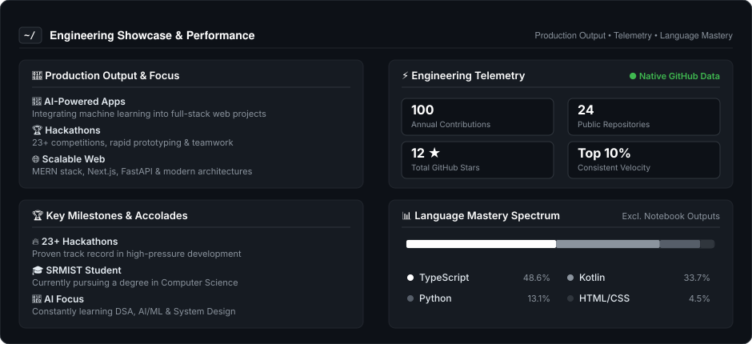

  
  
    

  # Rudra
  
  

    
  

  ### 🚀 Shipping AI & Web Projects
  
  **Developer • AI Enthusiast • Hackathon Addict**

   

  
  &nbsp;
  

---

### 👨‍💻 About Me

I'm a **CSE Student** at SRMIST and a developer who loves building innovative projects. I specialize in the intersection of Artificial Intelligence, Full-Stack Web Development, and Cybersecurity.

* 🏆 **Hackathons:** I thrive in competitive environments and have participated in over **23+ hackathons**.
* 🧠 **AI & ML:** Building AI-powered web applications and exploring advanced concepts.
* 💻 **Development:** Proficient in the MERN stack, Next.js, and scalable backend systems.
* 🤝 **Collaboration:** Always looking to team up on Web3, AI, and ambitious software engineering projects.

---

### 📡 Technical Capability & Skills Radar

  

---

### 🛠️ Core Tooling & Technologies

| **Category** | **Technologies** |
| :--- | :--- |
| **Languages** |  |
| **Web & Full Stack** |  |
| **Databases** |  |
| **Game & Platforms** |  |

---

### 📈 Activity & Contribution Flow

  

---

### ⚡ Engineering Showcase & Performance

  

---

### 🎮 The Human Side

I'm not just a code machine. When the IDE closes, here is who I am:

* **🎮 Gaming:** When I'm not coding, I'm likely exploring virtual worlds.
* **🛠️ Building:** I love turning ideas into reality, especially during intense 24-hour hackathons.
* **🌐 Web3:** Fascinated by decentralized systems and the future of the web.

---

  Let's innovate together.

